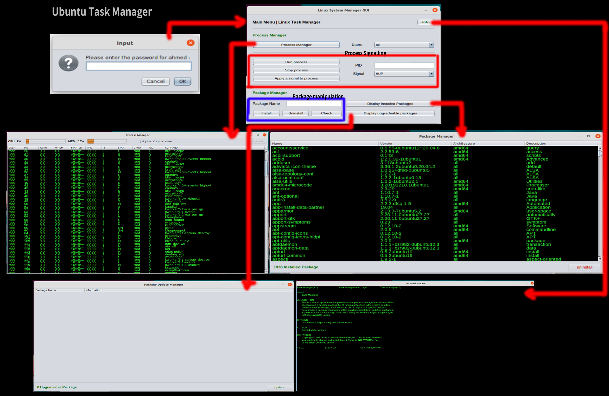

# Ubuntu Task Manager

## Process Manager
  - A. List all the processes in the system.
  - B. List all the processes grouped by user.
  - C. Display the process ID of all the processes.
  - D. Run/stop a specific process.
  - E. Send specific signals to a process.

## Package Manager
  -A. List all the installed packages in the system.
  -B. List all upgradeable packages in the system.
  -C. Install a specific package (e.g., Unrar).
  -D. Uninstall a package by name (e.g., Unrar).
  -E. Check if a specific package is installed.

## Application Outlines 
  - `Menu Interface`:
    - The application provides a menu interface allowing the user to select desired options.
    - The menu reappears until the user exits the application.
  - `Manual Page`:
    - Supports a manual page for the project.

## Application Overview

